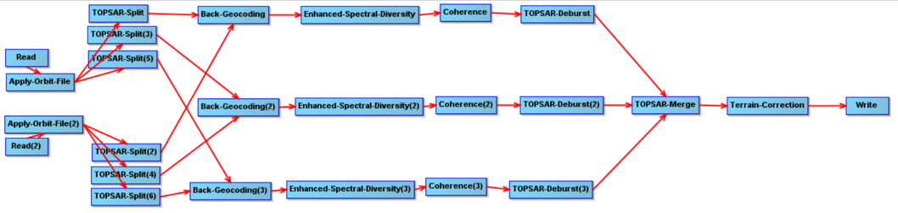

 

# 'cuu-illegal-waste'

This code was developed by JNCC under the Copernicus User Uptake Work Package 6 project focussing on monitoring illegal waste using Sentinel-1 imagery. This project is joint-funded by Scottish Government through the JNCC Simple Analysis Ready Data Service Project. 

## SLCCoh_Scot_CommandLine.xml 

This XML (eXtensible Markup Language ) script processes the Sentinel-1 imagery using JASMIN. These processes are graphically represented below:

   

 

* Read - Input source file (Sentinel-1 SLC product). Read is the first image and Read(2) is what will be compared to the first image, indicating if there have been any changes between the two scenes.
 
 * Apply Orbit File - This step applies the orbit file to each source image, providing accurate satellite position and velocity information. 

* TOPSAR-Split - Input source file (Sentinel-1 SLC product). Read is the first image and Read(2) is what will be compared to the first image, indicating if there have been any changes between the two scenes.

* Back-Geocoding - This step co-registers the two TOPSAR-Split outputs from the source files and a Digital Elevation Model (DEM). 

* Enhanced Spectral Diversity - Further enhances the co-registration and follows back-geocoding

* Coherence - This operator computes and estimates the coherence image for the scene.

* TOPSAR-Deburst - Sentinel-1 acquires 9 images (bursts) per sub-swath (see TOPSAR-Split). This operator merges the 9 bursts into a single image

* TOPSAR-Merge - This operator merges the sub-swaths into a single coherence image

* Terrain-Correction - This step corrects for the tilt of the satellite sensor and takes into account the geometric representation of the image. 

* Write - Exports the coherence layer

Supporting command line scripts included:

* convert_to_tif.sh
* ProcessSLC_Scotland.sh
* ProcessSLC_Scotland_fromInput.sh
